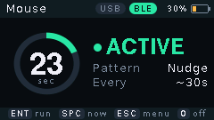
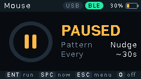
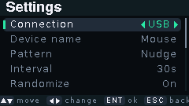
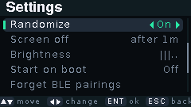
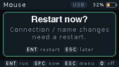

# Mouse Jiggler - Cardputer ADV

Firmware that turns an M5Stack **Cardputer ADV** into a mouse jiggler. It moves the pointer at intervals so a computer doesn't go idle, lock or sleep. It connects over **USB**, **Bluetooth Low Energy (BLE)**, or **both at once**, and every setting is changed on the device.

- Works as a standard HID mouse, so no drivers are needed on Windows, macOS, Linux, Android or iOS
- Three movement patterns, each of which returns the pointer to where it started
- Countdown ring, link status and battery level on the main screen
- Settings menu with a custom device name, intervals, randomization, screen auto-off and brightness
- Battery friendly: 80 MHz CPU and automatic screen off
- In USB mode, nothing is sent while the computer sleeps, so the jiggler never wakes it

<p>
  
  
</p>

## Installing

### With Launcher (SD card)

1. Download `MouseJiggler-CardputerADV-<version>.bin` from the Releases page, or build it yourself (see below).
2. Copy it to the Cardputer's SD card.
3. In [Launcher](https://github.com/bmorcelli/Launcher), choose **SD → the file → Install**.

### Over USB from source

1. Install [VS Code](https://code.visualstudio.com/) and the **PlatformIO IDE** extension.
2. Open this folder and plug in the Cardputer with a USB-C **data** cable.
3. Click **Upload** (→) in the PlatformIO status bar, or run `pio run -t upload`.

If the upload can't find the board, switch it **off**, hold **G0**, plug in the cable, then release G0 to enter download mode.

> Uploading over USB writes the full image and replaces Launcher, if you have it installed.

### Build output

Every `pio run` writes `MouseJiggler-CardputerADV-<version>.bin` to `dist/`. It is a merged image (bootloader, partitions and app) that Launcher, M5Burner and web flashers accept.

## Connecting

| Mode | How |
|---|---|
| **USB** | Plug into the computer. It appears as a regular USB mouse. |
| **BLE** | On the computer, open Bluetooth settings, choose *Add device*, then pick the device name (default **Mouse**). |
| **USB+BLE** | Both at once. Each movement goes to every connected computer. |

The labels in the header show link state: **green** = connected, **grey** = not connected, **blinking blue** = BLE waiting to pair.

If USB isn't detected at all, check the cable first. Many USB-C cables are charge-only.

## Controls

The Cardputer's arrow keys are `;` (up), `.` (down), `,` (left) and `/` (right). **ESC** is the top-left `` ` `` key.

### Main screen

| Key | Action |
|---|---|
| `Enter` or **G0** button | Start / pause jiggling |
| `Space` | Jiggle once now |
| `ESC` | Open Settings |
| `O` | Turn the screen off |
| ← / ↓ | Shorter interval |
| → / ↑ | Longer interval |
| `P` | Next pattern |

When the screen is off, any key turns it back on. That key press does nothing else.

### Settings

| Key | Action |
|---|---|
| ↑ / ↓ | Move the selection |
| ← / → | Change the selected value |
| `Enter` | Open the name editor, or run *Forget BLE pairings* / *Restart device* |
| `ESC` or `Del` | Save and go back |

### Name editor

Type to edit. `Del` erases, `Enter` saves and `ESC` cancels.

## Settings

<p>
  
  
</p>

| Setting | Options | Default |
|---|---|---|
| Connection | USB · BLE · USB+BLE *(applies after restart)* | USB+BLE |
| Device name | Up to 20 characters, used as both the USB and BLE name *(applies after restart)* | Mouse |
| Pattern | **Invisible**: 1 px out and back · **Nudge**: a few px in a random direction and back · **Circle**: a small circle | Circle |
| Interval | 5 s · 15 s · 30 s · 45 s · 1 m · 2 m · 3 m · 5 m | 30 s |
| Randomize | ±30 % on each interval | On |
| Screen off | Never · 15 s · 30 s · 1 m · 2 m · 5 m of inactivity | 30 s |
| Brightness | 5 levels | 3 |
| Start on boot | Start jiggling as soon as it powers up | Off |
| Forget BLE pairings | Removes every paired computer | |
| Restart device | Applies pending connection or name changes | |
| Firmware | Installed version | |
| GitHub | Project author | |

Settings are saved to flash and kept across reboots and firmware updates. When a connection or name change is waiting for a restart, the main screen shows **! Restart to apply**, and leaving the settings asks whether to restart now:

<p>
  
</p>

After you rename the device, the computer may keep showing the old Bluetooth name. Remove the device in its Bluetooth settings and pair again.

## Project layout

```
src/main.cpp        app state, screens, input handling
src/ui.cpp          drawing (240x135, double-buffered, pixel-aspect corrected)
src/jiggler.cpp     non-blocking movement patterns and scheduling
src/usb_mouse.cpp   TinyUSB HID mouse + CDC serial port
src/ble_mouse.cpp   NimBLE HID-over-GATT mouse
src/settings.cpp    settings persisted in NVS
scripts/            build helpers (merged .bin output, path stripping)
```

Built with PlatformIO (`espressif32`, Arduino), [M5Cardputer](https://github.com/m5stack/M5Cardputer) and [NimBLE-Arduino](https://github.com/h2zero/NimBLE-Arduino).

## Author

[github.com/tomtordev](https://github.com/tomtordev)

## License

[MIT](LICENSE)
